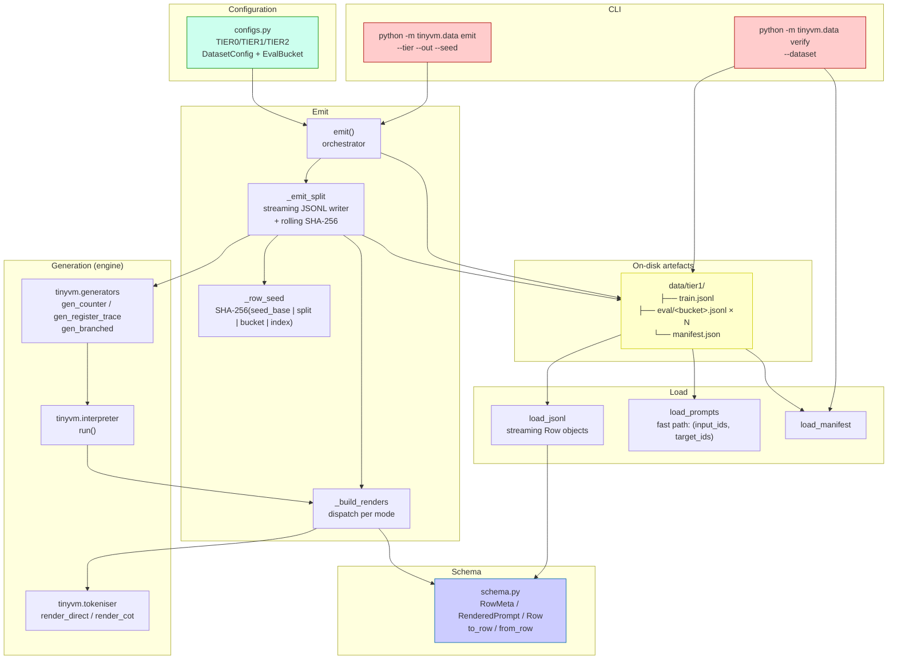
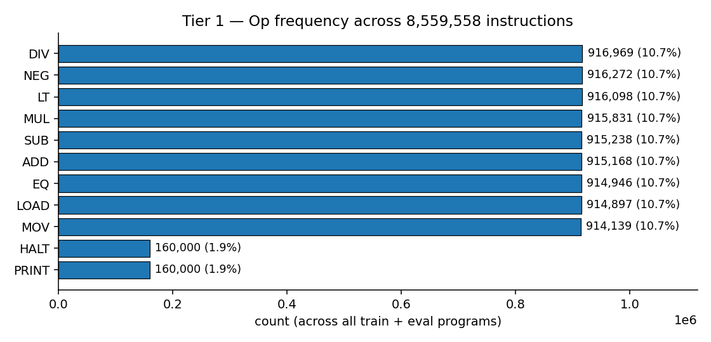
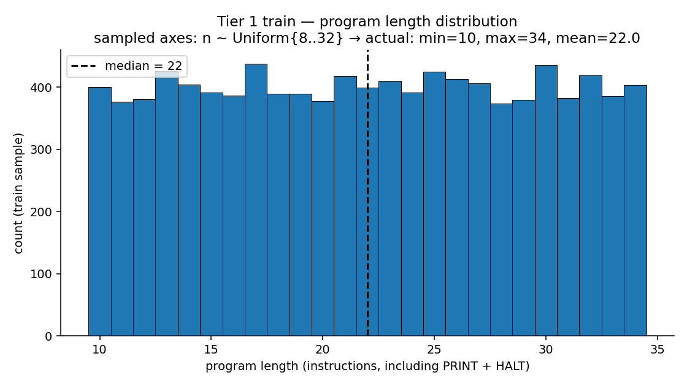
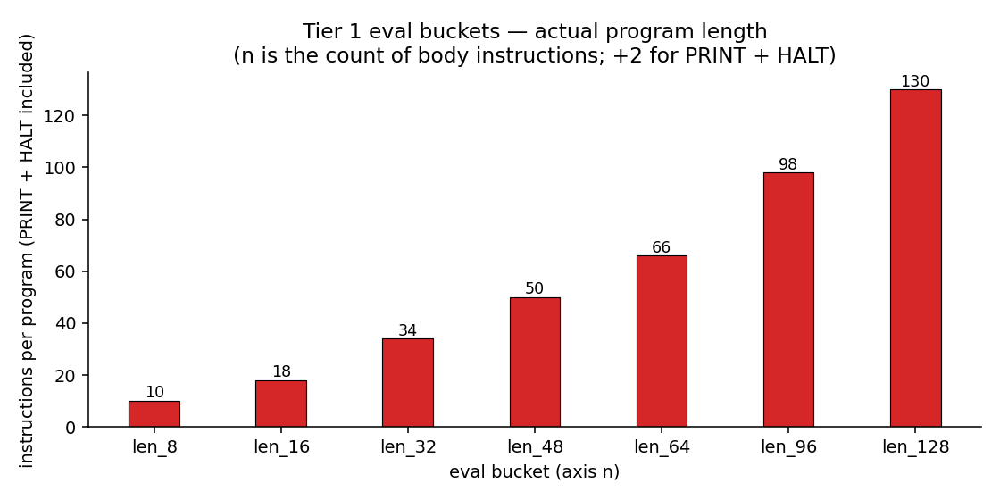
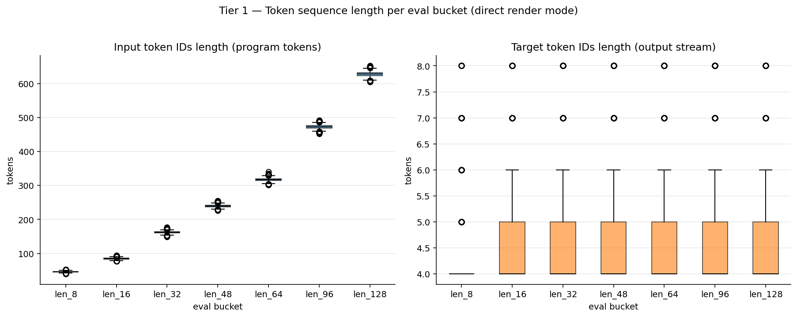
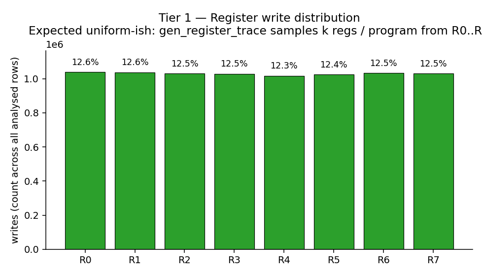

# Tiny-VM — Dataset Pipeline and Live Datasets

> The `tinyvm/data/` sub-package: materialise per-tier Tiny-VM curricula to JSONL on disk, with streaming readers, a CLI, and a byte-integrity manifest. Plus the live **Tier 1** dataset on the HuggingFace Hub with full statistical characterisation.

For the underlying Tiny-VM module — ISA, interpreter, generators, tokeniser — see the companion [`tinyvm_documentation.md`](tinyvm_documentation.md).

---

## Table of contents

1. [The curriculum at a glance](#1-the-curriculum-at-a-glance)
2. [Per-tier specifications](#2-per-tier-specifications)
3. [Pipeline architecture](#3-pipeline-architecture)
4. [Row schema in detail](#4-row-schema-in-detail)
5. [Determinism and reproducibility](#5-determinism-and-reproducibility)
6. [The manifest and integrity model](#6-the-manifest-and-integrity-model)
7. [CLI reference](#7-cli-reference)
8. [Live dataset: Genesis-AI-Labs/tinyvm-tier1](#8-live-dataset-genesis-ai-labstinyvm-tier1)
9. [Statistics and visualisations](#9-statistics-and-visualisations)
10. [Access patterns and code samples](#10-access-patterns-and-code-samples)
11. [Performance characteristics](#11-performance-characteristics)
12. [Storage and footprint](#12-storage-and-footprint)
13. [Generating your own datasets](#13-generating-your-own-datasets)
14. [Deferred work](#14-deferred-work)
15. [References](#15-references)

---

## 1. The curriculum at a glance

The Tiny-VM data pipeline is organised as a **6-tier curriculum** — a sequence of synthetic datasets of increasing complexity, designed for studying how a small LM internalises register-machine semantics. Each tier exercises a specific axis of difficulty.

| Tier | Status | Generator | Train | Eval | Render modes | Purpose |
|---|---|---|---|---|---|---|
| **0** | ✅ shipped | `gen_counter` | 100K | 10K (one bucket) | `direct` | Pipeline sanity / smoke |
| **1** | ✅ shipped + **live on Hub** | `gen_register_trace` | 200K | 7×20K = 140K | `direct` | Register file tracking, length generalisation |
| **2** | ✅ shipped | `gen_branched` | 500K | 4×10K = 40K | `direct` + `cot` | Branches, loops, optional stack; chain-of-thought |
| 3 | (intentional gap) | — | — | — | — | Reserved for an intermediate variant if needed |
| 4 | ⏸ deferred | `gen_userop_trace` | — | — | `userop_direct`, `userop_with_decomposition` | Few-shot userop induction. Needs a row-variant schema (see §14) |
| 5 | ⏸ future | — | — | — | — | Hand-off to Qwen-class models (uses `_text` renders) |

**Status legend:**

- ✅ shipped — emit works, tests pass, can be materialised today via `python -m tinyvm.data emit --tier tier{N}`
- ⏸ deferred — described in spec, not yet implemented (tracked with TODOs in code)

Spec sources of truth: `Latent_State_as_Computer.docx` §11.2 (dataset sizes) and §17 (Day 3 deliverable).

---

## 2. Per-tier specifications

All three shipped tiers are defined declaratively in `tinyvm/data/configs.py` as `DatasetConfig` literals.

### 2.1 Tier 0 — counter programs

```python
TIER0 = DatasetConfig(
    tier="tier0",
    train_size=100_000,
    train_axes=lambda rng: {"n": rng.randint(4, 8)},
    eval_buckets=(EvalBucket(name="all", size=10_000, fixed_axes={"n": 8}),),
    build=lambda rng, axes: gen_counter(n=axes["n"], rng=rng),
    renders=("direct",),
)
```

| Property | Value |
|---|---|
| Generator | `gen_counter` (linear ops on R0, terminal PRINT R0) |
| Train axes | `n ∈ {4..8}` uniformly |
| Eval | single bucket `all` with `n=8` fixed |
| Render | `direct` only |
| Program length | `n + 2` instructions (PRINT + HALT) |
| Total rows | 110,000 |

### 2.2 Tier 1 — register traces

```python
TIER1 = DatasetConfig(
    tier="tier1",
    train_size=200_000,
    train_axes=lambda rng: {
        "n": rng.randint(8, 32),
        "k": rng.choice([2, 4, 8]),
    },
    eval_buckets=tuple(
        EvalBucket(name=f"len_{n}", size=20_000, fixed_axes={"n": n, "k": 4})
        for n in (8, 16, 32, 48, 64, 96, 128)
    ),
    build=lambda rng, axes: gen_register_trace(n=axes["n"], k=axes["k"], rng=rng),
    renders=("direct",),
)
```

| Property | Value |
|---|---|
| Generator | `gen_register_trace` (straight-line, multi-register, no branches) |
| Train axes | `n ∈ {8..32}` uniformly, `k ∈ {2, 4, 8}` chosen uniformly |
| Eval | 7 length-stratified buckets: `n ∈ {8, 16, 32, 48, 64, 96, 128}`, all with `k=4` |
| Render | `direct` only |
| Program length | `n + 2` |
| Total rows | 340,000 |
| **Length generalisation** | Train tops at `n=32`. Eval buckets `len_48, len_64, len_96, len_128` test extrapolation. `len_128` is **4× longest training program**. |

### 2.3 Tier 2 — branches, loops, stack

```python
TIER2 = DatasetConfig(
    tier="tier2",
    train_size=500_000,
    train_axes=lambda rng: {
        "n": rng.randint(16, 256),
        "k": rng.choice([4, 6, 8]),
        "b": rng.randint(1, 8),
        "l": rng.randint(0, 16),
        "use_stack": rng.random() < 0.5,
        "stack_frames": rng.randint(0, 2),
    },
    eval_buckets=(
        EvalBucket("easy",        10_000, {"n":  32, "k": 4, "b": 1, "l":  0, "use_stack": False, "stack_frames": 0}),
        EvalBucket("medium",      10_000, {"n":  64, "k": 4, "b": 2, "l":  4, "use_stack": False, "stack_frames": 0}),
        EvalBucket("hard",        10_000, {"n": 128, "k": 6, "b": 4, "l":  8, "use_stack": True,  "stack_frames": 1}),
        EvalBucket("ood_len_256", 10_000, {"n": 256, "k": 4, "b": 2, "l":  4, "use_stack": False, "stack_frames": 0}),
    ),
    build=lambda rng, axes: gen_branched(spec=GenSpec(**axes), rng=rng),
    renders=("direct", "cot"),
)
```

| Property | Value |
|---|---|
| Generator | `gen_branched` (constructive control flow + random fill) |
| Train axes | 6-dim: `n`, `k`, `b`, `l`, `use_stack`, `stack_frames` |
| Eval | 4 named buckets covering difficulty quartiles + length OOD |
| Render | `direct` + `cot` (chain-of-thought with per-step register file) |
| Total rows | 540,000 |
| Storage estimate | ~5 GB (per spec §11) |
| Emit time estimate | 2–4 hours single-process |

The four eval buckets pin specific axis combinations: **`easy`** (one branch, no loops), **`medium`** (some branches and loops), **`hard`** (branches + loops + stack), **`ood_len_256`** (4× longest train `n`).

---

## 3. Pipeline architecture

The data pipeline is six focused files implementing **emit → manifest → load → verify** with deterministic, byte-exact reproducibility.



### 3.1 File responsibilities

| File | LOC | Role |
|---|---:|---|
| `__init__.py` | 19 | Public re-exports per spec §4 |
| `schema.py` | 141 | Row dataclasses + `to_row`/`from_row` (de)serialisation |
| `configs.py` | 138 | Per-tier `DatasetConfig` literals + `CONFIGS` registry |
| `emit.py` | 163 | `_row_seed`, `_build_renders`, `_emit_split`, `emit()`, manifest writer |
| `load.py` | 51 | `load_jsonl`, `load_split`, `load_prompts`, `load_manifest` |
| `__main__.py` | 71 | `argparse` CLI: `emit` and `verify` subcommands |
| **Total** | **583** | Excluding tests |

### 3.2 Hybrid layout: flat train + stratified eval

```
data/
└── tier1/
    ├── train.jsonl                 (200K rows, 654 MB)
    ├── eval/
    │   ├── len_8.jsonl             (20K rows, 32 MB)
    │   ├── len_16.jsonl            (20K rows, 54 MB)
    │   ├── len_32.jsonl            (20K rows, 99 MB)
    │   ├── len_48.jsonl            (20K rows, 143 MB)
    │   ├── len_64.jsonl            (20K rows, 187 MB)
    │   ├── len_96.jsonl            (20K rows, 276 MB)
    │   └── len_128.jsonl           (20K rows, 365 MB)
    └── manifest.json               (1.2 KB; written LAST)
```

**Why hybrid?** Train is consumed end-to-end by a `DataLoader`; eval is consumed per-bucket (you want accuracy-by-length curves, not a single eval number). A flat train file is faster and avoids tiny-file overhead; stratified eval files give you per-bucket metrics for free.

---

## 4. Row schema in detail

Every row in every `.jsonl` file is a single JSON object with **four top-level keys**: `meta`, `program`, `trace`, `renders`. The data is the contract — no downstream code needs the Python schema classes to read a row.

```json
{
  "meta":    { "tier": "tier1", "split": "eval", "bucket": "len_8",
               "seed": 7502970485723022491,
               "axes": {"n": 8, "k": 4},
               "renders": ["direct"] },
  "program": [
    {"op": "ADD",   "args": [3, 7, 3], "label": null, "target": null},
    {"op": "DIV",   "args": [3, 3, 7], "label": null, "target": null},
    ...
    {"op": "PRINT", "args": [5],       "label": null, "target": null},
    {"op": "HALT",  "args": [],        "label": null, "target": null}
  ],
  "trace": {
    "steps": [
      {"pc": 0, "regs": [0,0,0,0,0,0,0,0], "stack": [], "emitted": null},
      ...
      {"pc": 8, "regs": [0,0,0,0,0,0,0,0], "stack": [], "emitted": 0},
      {"pc": 9, "regs": [0,0,0,0,0,0,0,0], "stack": [], "emitted": null}
    ],
    "output": [0],
    "halted": true
  },
  "renders": {
    "direct": {
      "input_ids":   [40, 2, 19, 23, 19, 39, 5, ..., 39, 41],
      "target_ids":  [40, 24, 39, 41],
      "input_text":  "ADD R3 R7 R3 \nDIV R3 R3 R7 \n...HALT \n",
      "target_text": "0\n"
    }
  }
}
```

### 4.1 Why store all four?

Each row carries the full IR (program + trace) **and** the pre-rendered prompt (both token IDs and surface text):

- **Rich IR** lets future render modes be computed without re-running the generator. If you add a `render_modified_cot` next month, you don't have to regenerate — you have `Program` and `ExecutionTrace` already.
- **Pre-rendered prompts** make rows immediately training-ready. No tokeniser dependency at train time; load and feed.
- **Both IDs and text** lets you pick: custom 64-vocab models read `input_ids`; Qwen-class models read `input_text` through their own tokeniser.

Storage cost is ~3 KB per Tier 1 row (varies by program length). Acceptable for the difficulty: a 500K-row Tier 2 fits in ~5 GB.

### 4.2 The four classes

```python
@dataclass(frozen=True)
class RowMeta:
    tier: str                          # "tier0" | "tier1" | "tier2"
    split: str                         # "train" | "eval"
    bucket: str | None                 # eval bucket name; None for train
    seed: int                          # row-specific 64-bit seed
    axes: dict[str, int | bool]        # axis values at generation time
    renders: tuple[str, ...]           # render modes populated

@dataclass(frozen=True)
class RenderedPrompt:
    input_ids: list[int]
    target_ids: list[int]
    input_text: str
    target_text: str

class Row(NamedTuple):
    program: Program
    trace: ExecutionTrace
    meta: RowMeta
    renders: dict[str, RenderedPrompt]
```

`to_row(program, trace, meta, renders) -> dict` and `from_row(dict) -> Row` are pure functions and **bit-exact inverses**. Round-trip is tested across 40 generated programs (`test_schema.py::test_round_trip_on_generated_programs`).

---

## 5. Determinism and reproducibility

The pipeline guarantees: **same `seed_base` → byte-identical files**, every time.

### 5.1 The seed-derivation function

```python
def _row_seed(seed_base: int, split: str, bucket: str | None, index: int) -> int:
    key = f"{seed_base}|{split}|{bucket or ''}|{index}".encode()
    return int.from_bytes(hashlib.sha256(key).digest()[:8], "big")
```

Every row gets a unique seed derived from the four-tuple `(seed_base, split, bucket, index)`. Properties:

- **Collision-resistant**: SHA-256 over a delimited input makes accidental collisions vanishingly unlikely. The pipe `|` separator prevents prefix-collision attacks.
- **64-bit, unsigned**: full range `[0, 2^64 - 1]`. Stored as `uint64` in the HF Parquet schema (float64 would silently truncate to 53 bits — see §10).
- **No leakage**: train and eval rows with the same index get different seeds because `split` differs.

### 5.2 The reseed contract

The most subtle correctness invariant. Originally `_emit_split` looked like:

```python
rng = random.Random(row_seed)
axes = config.train_axes(rng)        # ← advances RNG state!
program = config.build(rng, axes)    # ← sees RNG at position N, not 0
```

This violated the spec's promise that `(meta.seed, meta.axes)` reconstructs `program`. A replay using `cfg.build(random.Random(row.meta.seed), row.meta.axes)` would get a fresh RNG at position 0 and produce a different program.

The fix (commit `567d3dd` on the data-pipeline PR):

```python
if split == "train":
    axes_rng = random.Random(row_seed)
    axes = config.train_axes(axes_rng)
elif split == "eval":
    axes = dict(bucket.fixed_axes)
# Fresh RNG for build, derived from the same row_seed.
program = config.build(random.Random(row_seed), axes)
```

Now `build()` always sees an RNG seeded directly from `row_seed`, independent of how many random draws the axes sampler consumed. The contract holds: anyone can reconstruct any train row from just `(meta.seed, meta.axes)` and the tier's `build` function. The regression test `test_pipeline.py::test_seed_reproducibility_per_row` exercises this on every loaded row.

### 5.3 The full reproducibility chain

```
seed_base + split + bucket + index
         ↓ SHA-256
      row_seed
         ↓ Random(row_seed) + train_axes  (or fixed_axes for eval)
        axes
         ↓ Random(row_seed) + build(rng, axes)
       Program
         ↓ run(program)
    ExecutionTrace
         ↓ render_*(program, trace)
   RenderedPrompt
         ↓ to_row + json.dumps + writer
   one line of JSONL
         ↓ sha256.update(line.encode("utf-8"))
  rolling SHA-256
         ↓ on file close
   file SHA in manifest
```

Every arrow is deterministic; every type is frozen or immutable. Two emit runs with the same `seed_base` produce two byte-identical directories. Verified by `test_emit.py::test_emit_is_deterministic`.

---

## 6. The manifest and integrity model

```json
{
  "tier": "tier1",
  "seed_base": 0,
  "tinyvm_version": "0.0.1",
  "tinyvm_commit": "6e745c9",
  "generated_at": "2026-05-17T08:30:45.956863Z",
  "files": {
    "train.jsonl":         {"rows": 200000, "sha256": "6f5f65facac0a5a7..."},
    "eval/len_8.jsonl":    {"rows":  20000, "sha256": "d95056ab55adeafc..."},
    "eval/len_16.jsonl":   {"rows":  20000, "sha256": "e424f3a701956eb6..."},
    "eval/len_32.jsonl":   {"rows":  20000, "sha256": "82acfc09eda74506..."},
    "eval/len_48.jsonl":   {"rows":  20000, "sha256": "04fa8dc7a4355a23..."},
    "eval/len_64.jsonl":   {"rows":  20000, "sha256": "7ad2fd111cfbdfb3..."},
    "eval/len_96.jsonl":   {"rows":  20000, "sha256": "10d7e2200a1ec223..."},
    "eval/len_128.jsonl":  {"rows":  20000, "sha256": "0efc14bedcb978e4..."}
  }
}
```

### 6.1 Atomicity contract

The manifest is written **LAST**, after all JSONL files are complete. This gives the pipeline a simple atomicity model:

- **Manifest present** → emit completed; every file's `sha256` is trustworthy
- **Manifest absent** → emit was interrupted; partial files exist but the dataset is incomplete

The `load_manifest()` function raises `FileNotFoundError` in the absent case; the CLI converts that to exit code 2 with a clear message. Consumers should never trust a directory without a manifest.

### 6.2 Verify subcommand

`python -m tinyvm.data verify --dataset data/tier1/` does:

1. Load the manifest (FileNotFoundError → exit 2 with `manifest.json missing` message)
2. For each `(relpath, expected)` in `manifest["files"]`:
   - If file doesn't exist → mismatch reason `"missing file"`
   - Else re-hash `path.read_bytes()` with SHA-256 and compare to `expected["sha256"]`
   - On mismatch, record reason `"sha256 mismatch: expected X, got Y"`
3. Exit 0 if all match (with `verify OK: <dir> (<n> files)` to stdout)
4. Exit 2 if any mismatches (per-file diff to stderr)

This is the **CI gate against dataset drift**. Run it before training to confirm the data hasn't been touched since emit.

### 6.3 Provenance fields

- **`tinyvm_version`** — from `importlib.metadata.version("tinyvm")`, falls back to `"0.0.0+unknown"`.
- **`tinyvm_commit`** — from `git rev-parse --short HEAD`, falls back to `"unknown"`.
- **`generated_at`** — ISO-8601 UTC with `Z` suffix.

Downstream loaders can pin "I only consume data from commit X" by checking `manifest["tinyvm_commit"]` before training. If the code has changed (renderer fix, generator drift), the SHA will differ and verify will fail; you re-emit.

---

## 7. CLI reference

### 7.1 Emit

```bash
python -m tinyvm.data emit --tier tier1 --out data/ [--seed 0]
```

| Flag | Required | Default | Meaning |
|---|---|---|---|
| `--tier` | yes | — | One of `tier0`, `tier1`, `tier2` |
| `--out` | yes | — | Output root directory; will create `<out>/<tier>/` |
| `--seed` | no | `0` | `seed_base` for determinism |

Exit codes:

- `0` — success, prints `manifest: <path>` to stdout
- `2` — unknown tier (error to stderr, lists valid tiers)
- Other non-zero — uncaught exception (programming bug; please report)

### 7.2 Verify

```bash
python -m tinyvm.data verify --dataset data/tier1/
```

| Flag | Required | Meaning |
|---|---|---|
| `--dataset` | yes | Path to a `<tier>/` directory containing `manifest.json` |

Exit codes:

- `0` — all files match manifest SHA-256; prints `verify OK: <dir> (<n> files)`
- `2` — any mismatch: missing manifest, missing file, SHA differs

---

## 8. Live dataset: Genesis-AI-Labs/tinyvm-tier1

**URL:** https://huggingface.co/datasets/Genesis-AI-Labs/tinyvm-tier1

The Tier 1 dataset (340K rows, 1.8 GB) is publicly available on the Hub. The repository contains **three layers** that serve different consumption patterns:

```
Genesis-AI-Labs/tinyvm-tier1/
├── README.md                          # dataset card (rendered on Hub)
├── data/                              # HF Parquet shards (native datasets format)
│   ├── train-00000-of-00001.parquet
│   ├── eval_len_8-00000-of-00001.parquet
│   ├── eval_len_16-00000-of-00001.parquet
│   ├── eval_len_32-00000-of-00001.parquet
│   ├── eval_len_48-00000-of-00001.parquet
│   ├── eval_len_64-00000-of-00001.parquet
│   ├── eval_len_96-00000-of-00001.parquet
│   └── eval_len_128-00000-of-00001.parquet
└── raw/                               # byte-exact emit output (preserves manifest)
    ├── train.jsonl                    # 654 MB
    ├── eval/
    │   ├── len_8.jsonl                #  32 MB
    │   ├── len_16.jsonl               #  54 MB
    │   ├── len_32.jsonl               #  99 MB
    │   ├── len_48.jsonl               # 143 MB
    │   ├── len_64.jsonl               # 187 MB
    │   ├── len_96.jsonl               # 276 MB
    │   └── len_128.jsonl              # 365 MB
    └── manifest.json
```

### 8.1 Schema gotchas the push baked in

Two real schema issues were discovered during the live push and are now fixed in `scripts/push_tier1_to_hub.py`:

1. **`meta.bucket` is `null` in train rows, `string` in eval rows.** Default Arrow inference produces incompatible types across splits, and `DatasetDict.push_to_hub` rejects with `ValueError`. The fix: explicit `Value("string")` (nullable) in the Features schema.

2. **`meta.seed` would have been inferred as `float64`.** SHA-derived 64-bit seeds routinely exceed 2^53 (the float64 mantissa limit), so inference would have silently truncated ~11 bits of entropy. The fix: pin to `Value("uint64")`. A sample seed `7502970485723022491` (~7.5 × 10^18) survives the round-trip intact.

Both fixes are documented in the script and will apply to any future tier0/tier2 push without rediscovery.

---

## 9. Statistics and visualisations

All figures below are computed from the live Tier 1 dataset (20K train sample + all 7×20K eval buckets = **160K rows analysed, 8.56M instructions counted**). Stats script: `scripts/compute_tier1_stats.py`; figure script: `scripts/make_tier1_figures.py`.

### 9.1 Op frequency



The nine fill ops (`ADD`, `SUB`, `MUL`, `DIV`, `NEG`, `LOAD`, `MOV`, `EQ`, `LT`) each appear with frequency ~10.7%, almost perfectly uniform — exactly what `gen_register_trace`'s uniform `rng.choice(_FILL_OPS)` would predict. `PRINT` and `HALT` each appear at 1.87% (exactly once per program, so frequency = 1 / mean_program_length ≈ 1 / 53.5).

No `JZ`, `JMP`, `PUSH`, `POP`, `NOP`, or userops appear — those are Tier 2 territory.

### 9.2 Program length distribution



Train programs follow the spec exactly: `n` uniformly sampled from `{8, 9, 10, ..., 32}`, then PRINT + HALT appended → final length `n + 2 ∈ {10, 11, ..., 34}`. The histogram is uniform across this range, as expected.

Per eval bucket, the length is pinned (because `fixed_axes["n"]` is constant per bucket):



Each bucket has effectively zero spread in length — every row in `len_64` has exactly 66 instructions. This is the property that makes per-bucket eval metrics interpretable as length-conditioned accuracy.

### 9.3 Token sequence length per bucket



**Input length** (the program tokens, BOS/EOS included) scales roughly linearly with `n`:

| Bucket | Program length | Input p50 | Input p95 | Input max |
|---|---:|---:|---:|---:|
| `len_8` | 10 | 46 | 48 | 53 |
| `len_16` | 18 | 85 | 88 | 94 |
| `len_32` | 34 | 162 | 167 | 177 |
| `len_48` | 50 | 240 | 246 | 256 |
| `len_64` | 66 | 317 | 325 | 341 |
| `len_96` | 98 | 472 | 481 | 494 |
| `len_128` | 130 | 628 | 638 | 654 |

So a model needs:

- **128-token context** for `len_8` and `len_16`
- **256-token context** through `len_48`
- **512-token context** through `len_96`
- **1024-token context** for full Tier 1 coverage (`len_128` max is 654)

**Target length** is uniformly tiny — median 4 tokens across all buckets, max 8. The target is always `BOS + digits + NEWLINE + EOS`, and the printed value rarely needs more than a few digits. This makes the supervision signal extremely concentrated: the model sees a 600-token program and must predict a 4-token answer.

### 9.4 Register usage



Writes are spread across all 8 registers, with a slight uniform-ish profile. This is generated by:

1. `gen_register_trace` samples `k` distinct registers from `{R0..R7}` per program (k ∈ {2, 4, 8} for train; k=4 for eval).
2. The destination register for each fill op is sampled from this active subset.

Per-program randomisation of which `k` registers are active avoids the positional bias that would otherwise put all activity on `R0`–`R3`. The histogram confirms the strategy works: no register is over- or under-represented by more than a few percent.

### 9.5 Summary table — Tier 1 dataset characteristics

| Quantity | Value (across all 160K analysed rows) |
|---|---:|
| Total rows | 340,000 (200K train + 7×20K eval) |
| Total instructions | 8,559,558 |
| Mean instructions per program | 25.2 |
| Median instructions per program (train) | 22 |
| Median input tokens (train) | 104 |
| Median target tokens (train) | 4 |
| Max input tokens (any bucket) | 654 (in `len_128`) |
| Output stream length | 1 (every program PRINTs once) |
| Distinct opcodes used | 11 (`ADD, SUB, MUL, DIV, NEG, LOAD, MOV, EQ, LT, PRINT, HALT`) |

---

## 10. Access patterns and code samples

### 10.1 Native HuggingFace `datasets` (recommended for training)

```python
from datasets import load_dataset

# All 8 splits at once
ds = load_dataset("Genesis-AI-Labs/tinyvm-tier1")
print(ds)
# DatasetDict({
#     train:        Dataset({features: ['meta', 'program', 'trace', 'renders'], num_rows: 200000})
#     eval_len_8:   Dataset({..., num_rows: 20000})
#     eval_len_16:  Dataset({..., num_rows: 20000})
#     eval_len_32:  Dataset({..., num_rows: 20000})
#     eval_len_48:  Dataset({..., num_rows: 20000})
#     eval_len_64:  Dataset({..., num_rows: 20000})
#     eval_len_96:  Dataset({..., num_rows: 20000})
#     eval_len_128: Dataset({..., num_rows: 20000})
# })

# A single split
eval_short = load_dataset("Genesis-AI-Labs/tinyvm-tier1", split="eval_len_8")
row = eval_short[0]
print(row["meta"])
# {'tier': 'tier1', 'split': 'eval', 'bucket': 'len_8',
#  'seed': 7502970485723022491, 'axes': {'n': 8, 'k': 4}, 'renders': ['direct']}

# Streaming for huge train splits
train = load_dataset("Genesis-AI-Labs/tinyvm-tier1", split="train", streaming=True)
for row in train.take(100):
    input_ids = row["renders"]["direct"]["input_ids"]
    target_ids = row["renders"]["direct"]["target_ids"]
    # ... feed model
```

### 10.2 Raw JSONL + `tinyvm.data.load_*` (byte-integrity preserved)

If you want the manifest's per-file SHA-256 guarantee and the exact byte contents:

```bash
# Download only the raw/ subtree
huggingface-cli download Genesis-AI-Labs/tinyvm-tier1 \
    --repo-type dataset \
    --include "raw/*" \
    --local-dir ./data

# Verify integrity end-to-end (exits 0 iff every SHA matches)
python -m tinyvm.data verify --dataset ./data/raw
```

Then stream with the project's loader (no Parquet dependency):

```python
from tinyvm.data import load_jsonl, load_prompts

# Full Row objects (Program + ExecutionTrace + meta + renders)
for row in load_jsonl("data/raw/train.jsonl"):
    print(row.meta.seed, row.program.instructions[0].op.name)
    print(row.trace.output)

# Fast path: just (input_ids, target_ids) — skips Program/Trace reconstruction
for input_ids, target_ids in load_prompts("data/raw/train.jsonl", mode="direct"):
    # ... feed to DataLoader
    pass
```

The **fast path is ~5x faster** than the full path because it doesn't go through `from_row` to reconstruct the IR. Use it whenever you only need the token IDs.

### 10.3 Reconstructing a program from `(seed, axes)` alone

```python
import random
from tinyvm.data.configs import TIER1
from tinyvm.interpreter import run

# Pick a row's metadata
meta_seed = 7502970485723022491
meta_axes = {"n": 8, "k": 4}

# Bit-exact reconstruction
program = TIER1.build(random.Random(meta_seed), meta_axes)
trace = run(program)

# This matches the stored row's program and trace exactly.
```

This is the contract that `_emit_split`'s reseed fix enforces. Useful if you want to extend a row with a render mode that wasn't originally emitted, or to verify a row hasn't drifted.

---

## 11. Performance characteristics

Measured on the M-series Mac used during development:

### 11.1 Emit performance

| Tier | Rows | Wall time | Rows/sec |
|---|---:|---:|---:|
| Tier 0 | 110K | ~30s (extrapolated) | ~3,700 |
| Tier 1 | 340K | **2m 12s actual** | ~2,580 |
| Tier 2 | 540K | ~30-120 min (estimated) | ~75-300 |

Tier 1's rate is dominated by JSON serialisation and SHA-256 update; the actual generator + interpreter + render is ~7K rows/sec in isolation. The bottleneck is single-process `json.dumps`. A `--workers N` flag is a documented future extension point.

### 11.2 Load performance

`load_prompts` (fast path) processes a `len_128.jsonl` shard (20K rows, 365 MB) in **~10 seconds** on a warm cache. `load_jsonl` (full path with `from_row` reconstruction) is ~5× slower because it builds `Program` / `ExecutionTrace` / `RenderedPrompt` objects for every row.

For training, **always prefer `load_prompts`** unless you actually need the IR.

### 11.3 Verify performance

`python -m tinyvm.data verify --dataset data/tier1/` re-hashes 1.8 GB and completes in **~3 seconds**. Acceptable for a per-CI-run gate.

---

## 12. Storage and footprint

### 12.1 Tier 1 file sizes

| File | Rows | Bytes | Bytes/row | Notes |
|---|---:|---:|---:|---|
| `train.jsonl` | 200,000 | 654 MB | 3,432 | Variable `n ∈ {8..32}`, average length 22 |
| `eval/len_8.jsonl` | 20,000 | 32 MB | 1,675 | Smallest bucket |
| `eval/len_16.jsonl` | 20,000 | 54 MB | 2,835 | |
| `eval/len_32.jsonl` | 20,000 | 99 MB | 5,200 | |
| `eval/len_48.jsonl` | 20,000 | 143 MB | 7,500 | |
| `eval/len_64.jsonl` | 20,000 | 187 MB | 9,818 | |
| `eval/len_96.jsonl` | 20,000 | 276 MB | 14,464 | |
| `eval/len_128.jsonl` | 20,000 | 365 MB | 19,124 | Largest bucket |
| `manifest.json` | — | 1.2 KB | — | Per-file SHA + provenance |
| **Total** | 340,000 | **1.8 GB** | ~5,600 avg | |

### 12.2 Byte-per-row scaling

Roughly `bytes_per_row ≈ 150 × n` for Tier 1, because each instruction contributes a JSON object (`{"op":"...", "args":[...], "label":null, "target":null}`) plus a trace step (`{"pc":N, "regs":[...8 ints...], "stack":[], "emitted":...}`). The `renders` block adds another `~3.5 × n` bytes for input_ids + a constant for target_ids + the surface text.

### 12.3 Hub-side storage

On the Hub:

- **Raw JSONL** is stored verbatim as LFS objects — same 1.8 GB.
- **Parquet** is column-store + dictionary-encoded + Snappy-compressed. The full DatasetDict typically compresses to **~30-50% of JSONL** size. For Tier 1, expect ~700-900 MB of Parquet.

Total Hub footprint: ~2.5 GB. Trivial for a research dataset.

---

## 13. Generating your own datasets

### 13.1 Emit a tier locally

```bash
pip install -e .                                         # in the FANC repo root
python -m tinyvm.data emit --tier tier1 --out data/      # ~2 min for Tier 1
python -m tinyvm.data verify --dataset data/tier1/       # ~3 sec; exits 0 if intact
```

### 13.2 Push to the Hub (using the provided script)

```bash
# After emit completes:
python scripts/push_tier1_to_hub.py
```

The script does three uploads: raw files (preserve byte integrity), Parquet (enable `load_dataset`), README.md (the dataset card).

For tier0 / tier2, copy and adapt:

```python
# scripts/push_tier0_to_hub.py
REPO_ID = "Genesis-AI-Labs/tinyvm-tier0"
LOCAL_ROOT = Path("data/tier0")
# Same FEATURES schema works for tier0 (renders=("direct",) → no schema change)
```

For Tier 2 specifically, the `renders` block contains both `direct` and `cot`, so the Features schema needs a second entry:

```python
"renders": {
    "direct": { ... },
    "cot":    { "input_ids": Sequence(Value("int64")),
                "target_ids": Sequence(Value("int64")),
                "input_text": Value("string"),
                "target_text": Value("string") },
},
```

### 13.3 Define a brand-new tier

1. Add a generator to `tinyvm/generators.py` (must self-validate).
2. Add the `DatasetConfig` literal + `CONFIGS["tier<N>"]` entry to `tinyvm/data/configs.py`.
3. The CLI picks it up automatically (`python -m tinyvm.data emit --tier tier<N>` works immediately).
4. Optionally add a `_tiny_tier<N>()` fixture to `test_pipeline.py` for integration coverage.

---

## 14. Deferred work

Documented with TODO comments in the code:

| Item | Code location | Tracking |
|---|---|---|
| **Tier 4 emission** (`UseropTrace` rows) | `tinyvm/data/configs.py:135` | Needs row-variant schema; `gen_userop_trace` is implemented but emits incompatible types |
| **Multi-process `--workers N`** | `tinyvm/data/emit.py:124` | Spec §3 decision 5; single-process is acceptable today |
| **HuggingFace `Dataset.from_generator` adapter** | `tinyvm/data/load.py:11` | One-liner; defer until train loop needs it |
| **`--no-text` flag** | (not yet) | Save ~30% storage by dropping `*_text` fields if Qwen path isn't used |
| **`--render direct` flag** | (not yet) | Save ~50% on Tier 2 by skipping `cot` renders |
| **Parquet conversion at emit time** | (not yet) | Skip the JSONL → Parquet hop on Hub push |
| **Per-row Op coverage test for Tier 2** | (not yet) | Verify `JZ`, `JMP`, `PUSH`, `POP` actually appear in tier2 emits |

---

## 15. References

- **Spec:** `docs/superpowers/specs/2026-05-16-tinyvm-data-pipeline-design.md` — design doc this pipeline implements.
- **Plan:** `docs/superpowers/plans/2026-05-16-tinyvm-data-pipeline.md` — 18-task implementation plan.
- **Companion doc:** [`tinyvm_documentation.md`](tinyvm_documentation.md) — the underlying Tiny-VM module.
- **Source of truth for sizes/axes:** `Latent_State_as_Computer.docx` §11.2.
- **Live dataset:** [Genesis-AI-Labs/tinyvm-tier1](https://huggingface.co/datasets/Genesis-AI-Labs/tinyvm-tier1)
- **Stats source data:** `docs/stats/tier1_stats.json` (2.8 MB; regenerate via `python scripts/compute_tier1_stats.py`)
- **Figure source:** `docs/figures/tier1_*.png` (regenerate via `python scripts/make_tier1_figures.py`)
- **PR #3** (data pipeline merged into main): https://github.com/mr-siddy/FANC/pull/3
- **PR #4** (HF push scripts): https://github.com/mr-siddy/FANC/pull/4
