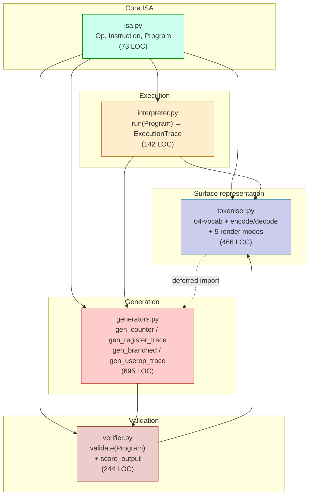
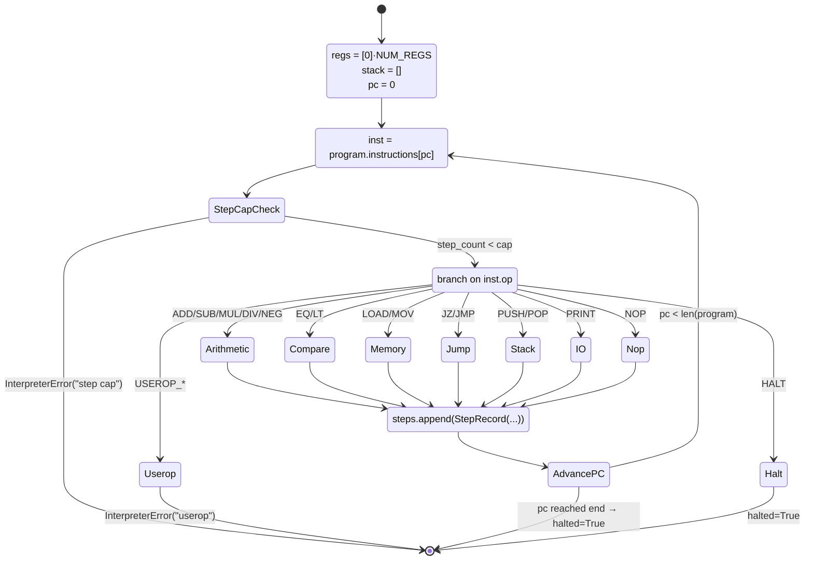
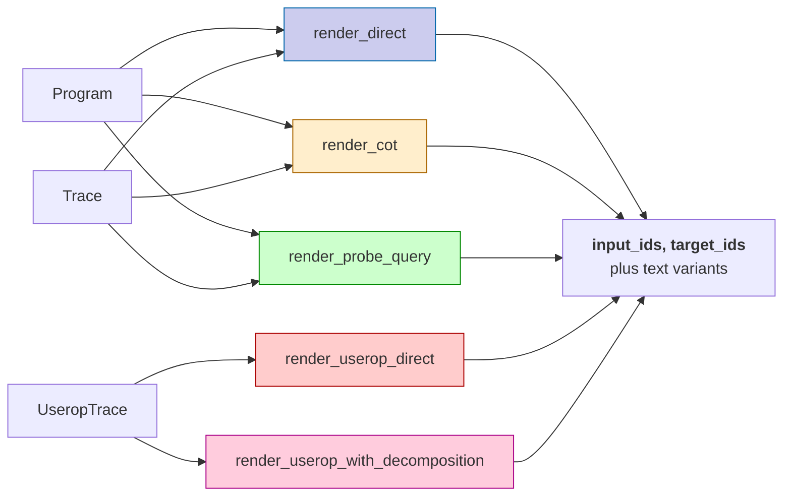

# Tiny-VM — Module Documentation

> A purpose-built, ISA-style toy virtual machine that generates synthetic programs, executes them, tokenises them, and validates them. Designed as the synthetic-data engine for the **FANC "Latent State as Computer"** research program.

---

## Table of contents

1. [What and why](#1-what-and-why)
2. [Module structure](#2-module-structure)
3. [The ISA](#3-the-isa)
4. [The interpreter](#4-the-interpreter)
5. [Vocabulary and tokeniser](#5-vocabulary-and-tokeniser)
6. [Render modes](#6-render-modes)
7. [Generators](#7-generators)
8. [Verifier](#8-verifier)
9. [End-to-end worked example](#9-end-to-end-worked-example)
10. [Public API surface](#10-public-api-surface)
11. [Design decisions and rationale](#11-design-decisions-and-rationale)
12. [Extension points](#12-extension-points)
13. [Performance and footprint](#13-performance-and-footprint)
14. [References](#14-references)

---

## 1. What and why

The Tiny-VM is a **deterministic toy ISA** with:

- 8 general-purpose registers (`R0..R7`)
- A bounded stack (max depth 16)
- 16 base opcodes (arithmetic, control flow, I/O) + 5 placeholder *userop* slots
- A fixed value range `[-1024, 1023]` with **arithmetic clamping** (no overflow trapping)
- A "generate-only-valid" contract — the interpreter assumes well-formed input; the verifier and generators carry the well-formedness invariant by construction

Its single job is to **produce a controlled stream of (program, execution trace, training prompt) triples** for studying how small language models internalise the structure of a register machine. Every part of the design exists in service of three properties:

1. **Bit-exact reproducibility** — same seed → same program → same trace → same tokens.
2. **Difficulty axes you can dial** — length `n`, active register count `k`, branch count `b`, loop budget `l`, stack use.
3. **Decoupling from a real ML stack** — pure Python + stdlib, no PyTorch / NumPy dependency, so the generator can run anywhere and the produced data is the contract.

The companion document [`tinyvm_dataset.md`](tinyvm_dataset.md) covers the data pipeline that materialises this engine into JSONL datasets on disk and pushes them to HuggingFace.

---

## 2. Module structure



Total: **~1620 LOC** across five files. Plus a `tinyvm/data/` sub-package (~580 LOC) which is documented separately in `tinyvm_dataset.md`. Tests: ~3000 LOC across 11 test files, 185 passing.

**Dependency rules:**

- `isa.py` is foundational — no internal imports.
- `interpreter.py` imports only from `isa`.
- `tokeniser.py` imports from `isa` and `interpreter`, plus a deferred (function-scope) import from `generators` to break the circular dependency around `UseropTrace`.
- `generators.py` imports from `isa` and `interpreter`, with deferred imports from `tokeniser` (for userop symbol bindings) and `verifier` (for self-validation).
- `verifier.py` imports from `isa` and `tokeniser`.

The circular interactions are intentional: generators self-validate by construction, the tokeniser needs the userop symbol table that generators populate, and the verifier reuses the tokeniser's arg-schema table. The deferred imports keep the dependency graph acyclic at module load time.

---

## 3. The ISA

### 3.1 Constants

| Name | Value | Meaning |
|---|---|---|
| `NUM_REGS` | 8 | Register file size; registers named `R0..R7` |
| `VAL_MIN`, `VAL_MAX` | `-1024`, `1023` | Clamping range for all register values |
| `LITERAL_MIN`, `LITERAL_MAX` | `-127`, `127` | Range for immediate `LOAD` literals |
| `STACK_DEPTH` | 16 | Maximum stack depth; PUSH overflow raises |
| `DEFAULT_STEP_CAP` | 1,000,000 | Hard cap on interpreter step count |

### 3.2 The Op enum (`tinyvm/isa.py:19`)

The `Op` enum is an `IntEnum` so opcodes are both human-readable (`Op.ADD.name == "ADD"`) and numerically ordered. Userop slots are integer values ≥ 16, which `Op.is_userop()` checks in one comparison.

| ID | Name | Mnemonic | Arity (regs, lits, target) | Semantics |
|---:|---|---|---|---|
| 0 | `LOAD` | `LOAD Ri, K` | (1, 1, false) | `Ri ← clamp(K)` |
| 1 | `MOV` | `MOV Ri, Rj` | (2, 0, false) | `Ri ← Rj` |
| 2 | `ADD` | `ADD Ri, Rj, Rk` | (3, 0, false) | `Ri ← clamp(Rj + Rk)` |
| 3 | `SUB` | `SUB Ri, Rj, Rk` | (3, 0, false) | `Ri ← clamp(Rj − Rk)` |
| 4 | `MUL` | `MUL Ri, Rj, Rk` | (3, 0, false) | `Ri ← clamp(Rj × Rk)` |
| 5 | `DIV` | `DIV Ri, Rj, Rk` | (3, 0, false) | `Ri ← truncated quotient; 0 if Rk == 0` |
| 6 | `NEG` | `NEG Ri, Rj` | (2, 0, false) | `Ri ← clamp(−Rj)` |
| 7 | `EQ` | `EQ Ri, Rj, Rk` | (3, 0, false) | `Ri ← 1 if Rj == Rk else 0` |
| 8 | `LT` | `LT Ri, Rj, Rk` | (3, 0, false) | `Ri ← 1 if Rj < Rk else 0` |
| 9 | `JZ` | `JZ Ri, Ltarget` | (1, 0, true) | If `Ri == 0`, jump to `Ltarget` |
| 10 | `JMP` | `JMP Ltarget` | (0, 0, true) | Unconditional jump |
| 11 | `PUSH` | `PUSH Ri` | (1, 0, false) | Push `Ri`; raise on overflow |
| 12 | `POP` | `POP Ri` | (1, 0, false) | Pop into `Ri`; raise on underflow |
| 13 | `PRINT` | `PRINT Ri` | (1, 0, false) | Emit `Ri` to output stream |
| 14 | `NOP` | `NOP` | (0, 0, false) | No-op (used as a label anchor) |
| 15 | `HALT` | `HALT` | (0, 0, false) | Terminate execution |
| 16 | `USEROP_0` | (symbolic) | (2, 0, false) | Default symbol `DOUBLE`; interpreter raises until substituted |
| 17 | `USEROP_1` | (symbolic) | (3, 0, false) | Default `MAX` |
| 18 | `USEROP_2` | (symbolic) | (2, 0, false) | Default `ABS` |
| 19 | `USEROP_3` | (symbolic) | (3, 0, false) | Default `MOD` |
| 20 | `USEROP_4` | (symbolic) | (2, 0, false) | Default `SIGN` |

### 3.3 Instruction and Program

```python
@dataclass(frozen=True)
class Instruction:
    op: Op
    args: tuple[int, ...] = ()      # register indices and/or literals
    label: str | None = None        # label defined at this line (e.g. "L3")
    target: str | None = None       # label referenced by JZ/JMP

@dataclass(frozen=True)
class Program:
    instructions: tuple[Instruction, ...]
    label_index: Mapping[str, int]   # built once at construction time
```

Both are frozen — programs are immutable values. The factory `Program.build(instructions)` precomputes `label_index` from `label` fields and rejects duplicate labels eagerly. The resulting `label_index` is wrapped in `MappingProxyType` so consumers cannot mutate it.

---

## 4. The interpreter

### 4.1 Execution model

`run(program: Program, step_cap=DEFAULT_STEP_CAP) -> ExecutionTrace` is a pure function. Inputs:

- A `Program`
- An optional step cap (default 1,000,000)

Outputs an `ExecutionTrace`:

```python
@dataclass
class ExecutionTrace:
    steps: list[StepRecord]      # one entry per executed instruction
    output: list[int]            # values emitted by PRINT
    halted: bool                 # True if program reached HALT or ran off the end
```

Each `StepRecord` is a complete snapshot:

```python
@dataclass(frozen=True)
class StepRecord:
    pc: int                       # instruction index executed at this step
    regs: tuple[int, ...]         # NUM_REGS snapshot AFTER this step
    stack: tuple[int, ...]        # full stack snapshot AFTER this step
    emitted: int | None           # value PRINTed, or None
```

The snapshot is taken **after** the instruction executes, so `steps[i].regs` is the register file as the next instruction would see it.

### 4.2 The execution loop



### 4.3 Semantics worth knowing

- **Registers initialise to 0.** No `LOAD` is required before reading.
- **Arithmetic clamps, not wraps.** `2000 + 2000 → 1023`, not overflow. The clamp is applied at the write site (one place).
- **Division by zero returns 0** — not an error. This is the most controversial semantic; chosen so the verifier doesn't need static divisor analysis and the interpreter has no error path for arithmetic.
- **Integer division** truncates toward zero (not floor). Python's `//` is floor, so the interpreter computes `abs(a) // abs(b)` and re-signs.
- **JZ takes a *register*, not a value** — `JZ Ri, Ltarget` jumps if `regs[i] == 0`.
- **Stack errors raise.** `PUSH` on a full stack and `POP` on an empty stack both raise `InterpreterError`. These are the only conditions a verifier-passing program can hit; they exist for safety, not for normal flow.
- **Userops raise.** If `Op.USEROP_*` reaches `run()`, you forgot to call `substitute_userops()` first. The error message says exactly that.

### 4.4 Error policy (asymmetric)

The interpreter raises only on conditions that **cannot happen** under generate-only-valid:

- Step cap exceeded (infinite loop)
- Stack overflow / underflow (verifier's stack-balance check would have caught this at generate time)
- Userop opcode encountered (caller forgot to substitute)
- Unhandled opcode (impossible — exhaustive Op enum)

The reasoning is "fail loud at generation time, never at training time." The interpreter is a pure function called millions of times; one raised exception during dataset emit halts the entire run, so generators must produce only programs the interpreter will never trip on. The verifier exists to prove that property.

---

## 5. Vocabulary and tokeniser

### 5.1 The 64-token vocabulary

The vocab is a flat list; ID = position. Built in five blocks:

```
0..15    OPCODE_TOKENS    LOAD MOV ADD SUB MUL DIV NEG EQ LT JZ JMP PUSH POP PRINT NOP HALT
16..23   REGISTER_TOKENS  R0 R1 R2 R3 R4 R5 R6 R7
24..33   DIGIT_TOKENS     0 1 2 3 4 5 6 7 8 9
34..43   STRUCTURAL       MINUS L COLON EQUALS DECOMP NEWLINE BOS EOS PAD ?
44..48   USEROP_TOKENS    DOUBLE MAX ABS MOD SIGN
49..63   RESERVED_0 .. RESERVED_14   (padded to 64)
```

The size is fixed at **`VOCAB_SIZE = 64`** by an assertion at module load time — so the embedding layer can be hard-coded once, and adding tokens means picking off the reserved slots in `_RESERVED_TOKENS` (no shape change).

### 5.2 Encoding integers

Integer literals are emitted as digit tokens with an optional leading `MINUS`. The function `_digits_of(n)` returns `["MINUS", "1", "2"]` for `-12`, `["3", "7"]` for `37`. Decoding inverts: read optional `MINUS`, then consume digits.

### 5.3 Encoding instructions

Each instruction renders as the optional label, the opcode token, register args (as `R0`..`R7`), literal args (as digit sequences), then optional target label, then `NEWLINE`. Example:

```
Instruction(Op.ADD, args=(3, 1, 2))               → ADD R3 R1 R2 NEWLINE
Instruction(Op.JZ,  args=(0,), target="L3")       → JZ R0 L 3 NEWLINE
Instruction(Op.JMP, args=(),   target="L7",
            label="L4")                            → L 4 COLON JMP L 7 NEWLINE
Instruction(Op.LOAD, args=(2, -42))               → LOAD R2 MINUS 4 2 NEWLINE
```

### 5.4 Encode / decode round-trip

`encode(Program) -> list[int]` flattens all instruction tokens and looks them up in `TOKEN_TO_ID`. `decode(list[int]) -> Program` consumes the token stream, rebuilds Instructions using `_OP_ARG_SCHEMA` to know how many register/literal/target tokens each opcode consumes, and returns a `Program.build(...)` result. Round-trip is bit-exact (modulo non-numeric label normalisation through `_LABEL_REGISTRY`).

### 5.5 The arg-schema table

`_OP_ARG_SCHEMA: dict[Op, tuple[int, int, bool]]` is the single source of truth for "this opcode has N register args, M literal args, and may/may not have a target label." Both the encoder, the decoder, and the verifier consult it. Adding a new opcode means: (1) add to the `Op` enum, (2) add its semantics to the interpreter, (3) add its row to `_OP_ARG_SCHEMA`. That's it.

---

## 6. Render modes

A "render" produces a `(input_ids, target_ids)` pair from `(Program, ExecutionTrace)`. Each mode is paired with a `_text` variant that produces human-readable surface strings (for hand-off to a real tokeniser like Qwen). The tokeniser exposes five rendering modes:



### 6.1 `render_direct` — answer-only

The most basic mode. Input is the full program; target is just the output stream.

```
input  = BOS + encode(program) + EOS
target = BOS + digits_of(output[0]) NEWLINE + digits_of(output[1]) NEWLINE + ... + EOS
```

For Tier 0/1, every program PRINTs exactly one value, so the target is `BOS + digits + NEWLINE + EOS` — typically **4 tokens**. The model has to predict the final printed value given the entire program tokens — a pure "simulate this code" task.

### 6.2 `render_cot` — chain-of-thought with register file

CoT mode adds **per-step register-file annotations** to the target. After each executed instruction, the target emits the instruction's surface tokens followed by the post-step register file:

```
input  = BOS + encode(program) + EOS
target = BOS + (for each step:
                 encode(inst at step.pc) +
                 register_file_tokens(step.regs, prev.regs, mode))
             + (for each output value: digits + NEWLINE)
             + EOS
```

Two register-file submodes:

- **`mode="full"`** — emit all 8 registers every step: `R0 EQUALS 0 R1 EQUALS 3 R2 EQUALS ... R7 EQUALS 0`.
- **`mode="modified"`** — emit only registers whose value changed since the previous step. Far more compact.

CoT is used by Tier 2 (alongside `direct`) because branched programs benefit from intermediate-state supervision.

### 6.3 `render_probe_query` — single-step probe

Pick a step `t`; render the input as the program tokens up to and including the instruction executed at step `t`, followed by a `?` marker. Render the target as the register file *at that step*.

```
input  = BOS + encode(program[0:executed_idx+1]) + ? + EOS
target = BOS + full_register_file_tokens(trace.steps[t].regs) + NEWLINE + EOS
```

This isolates "given the program prefix, what is the machine state right now?" — useful for studying state representations rather than final-answer accuracy.

### 6.4 `render_userop_direct` and `render_userop_with_decomposition` — Tier 4

Tier 4 uses few-shot demonstrations. A `UseropTrace` carries a list of demo programs (each calling a placeholder userop like `DOUBLE`) and one target program. The two renders differ in whether the demos include `DECOMP` annotations that show the userop's base-op expansion.

These are implemented but not yet exercised by the data pipeline (Tier 4 is deferred per spec §2 — needs a row-variant schema).

### 6.5 Surface text vs token IDs

Every render mode has a `_text` variant that takes the same inputs and returns `(input_text, target_text)` strings. The text variants call the ID-emitting variant and then run `_tokens_to_text` which:

- Drops `BOS`, `EOS`, `PAD`
- Renders `NEWLINE` as `\n`
- Attaches `MINUS` to the following digit (`-12`, not `- 12`)
- Attaches `EQUALS` and `COLON` without spaces (`R0=5`, `L3:`)
- Otherwise space-separates tokens

This means downstream Qwen-tokeniser pipelines can read `input_text` directly without going through the custom 64-vocab.

---

## 7. Generators

Four generators, one per tier. All share three properties:

1. **Self-validating** — each generator calls `verifier.validate()` on its output and `assert`s. If generation drifts, the assertion fires at emit time, not training time.
2. **Constructive control flow** — branches and loops are emitted from templates with pre-allocated counters and labels, so the resulting CFG is guaranteed well-formed. Straight-line "fill" instructions are sampled randomly.
3. **No `MUL`/`DIV` for trivial tiers** — the counter generator restricts to `ADD/SUB/NEG/MOV` to avoid clamping/zero-div artefacts in pipeline-sanity programs.

### 7.1 `gen_counter` — Tier 0

Pure linear sequence on `R0`:

```
LOAD R0 <literal>     # initial seed
<n-1 ops>             # random choice of ADD/SUB/NEG/MOV, all targeting R0
PRINT R0
HALT
```

Used to sanity-check the pipeline end-to-end. Total length = `n + 2`.

### 7.2 `gen_register_trace` — Tier 1

Multi-register straight-line:

1. Sample `k` distinct active registers from `R0..R7` (this randomises per-program to avoid positional bias).
2. Fill `n` instructions from `_FILL_OPS = {LOAD, MOV, ADD, SUB, MUL, DIV, NEG, EQ, LT}`. Destination register sampled from active; source registers sampled freely.
3. PRINT the most-recently-written non-distractor register.
4. HALT.

Optional `ShapingSpec` knobs (off by default):

- **`flat_output_histogram`** — rejection-sample over the output value's `// 100` bucket to flatten the histogram of printed values (combats long-tail printing-of-zero artefacts).
- **`distractor_regs`** — reserve `n_dist` registers that get written but are excluded from the print pool, so the model can't just "print whatever was last loaded".
- **`randomize_print_target`** — break the "PRINT-most-recent-write" heuristic.
- **`decorrelate_length`** — placeholder for future length-padding tricks.

Total length = `n + 2`.

### 7.3 `gen_branched` — Tier 2 (and Tier 4 substrate)

The most elaborate generator. Builds a program from **regions** assembled in order:

```mermaid
flowchart TD
    A[Allocate active set: k regs] --> B[Reserve registers]
    B -->|r_one, counters, r_k, r_diff, print_target| C[LOAD r_one, 1]
    C --> D[LOAD print_target, lit]
    D --> E[Warm-up fill: max(k, 4) instructions]
    E --> F{For each branch}
    F --> G[3-way roll: if / if-else / arith-zero]
    G --> H{For each loop}
    H --> I[3-way template choice:<br/>countdown / countup / test-at-top]
    I --> J{If use_stack}
    J --> K[PUSH/POP frame pairs]
    K --> L[PRINT print_target]
    L --> M[HALT]
    J -.skip if not use_stack.-> L
```

Difficulty axes (the `GenSpec` dataclass):

| Axis | Range | Effect |
|---|---|---|
| `n` | total instruction budget | overall length |
| `k` | 2..8 | active register subset size |
| `b` | 0..8 | number of branch regions |
| `l` | 0..16 | total loop iteration budget (split across `1..min(4, l)` loops) |
| `use_stack` | bool | inject `PUSH`/`POP` regions |
| `stack_frames` | 0..2 | number of stack regions if `use_stack` |

Three branch templates:

- **`if`** — `LT/EQ rc, ri, rj; JZ rc, L_after; <then>; L_after: NOP`
- **`if-else`** — same but with both arms
- **`arith-zero`** — `ADD/SUB/MUL/MOV rc, ri, rj; JZ rc, L_after; <then>; L_after: NOP`

Three loop templates:

- **`countdown`** — `counter ← K; loop: <body>; counter -= r_one; JZ counter, done; JMP loop`
- **`countup`** — `counter ← 0; r_k ← K; loop: <body>; counter += r_one; r_diff ← r_k - counter; JZ r_diff, done; JMP loop`
- **`test-at-top`** — `counter ← K; loop: JZ counter, done; <body>; counter -= r_one; JMP loop`

Register protection — these registers are **excluded from fill** (cannot be clobbered):

- `r_one` (always)
- All loop counters (always)
- `r_k` and `r_diff` inside countup loop bodies only

This is the difference between a generator that produces valid code and one that produces *interesting* valid code. Without these exclusions, fill instructions would routinely overwrite the loop counter and the verifier's stack-balance check would fire half the time.

### 7.4 `gen_userop_trace` — Tier 4 (deferred from data pipeline)

Produces a `UseropTrace` — a structured object with a list of `(with_symbol, base, trace)` demo pairs plus one target pair, where:

- `with_symbol` is a program using a userop opcode like `USEROP_0` (rendered as `DOUBLE`)
- `base` is the same program with `substitute_userops(...)` applied to inline the userop's base-op expansion
- `trace = run(base)` is the trace of the substituted form

This generator is **implemented and tested** in the tinyvm module but **not currently emitted to disk**. The data pipeline's row schema models a single program per row; Tier 4 needs a row variant for `UseropTrace`. Tracked as a TODO in `tinyvm/data/configs.py`.

---

## 8. Verifier

`validate(program: Program, userop_signatures=None) -> bool` runs five static checks:

1. **`_check_arity`** — every instruction's `args` length matches its opcode's schema; instructions with `has_target` carry a non-None `target`.
2. **`_check_label_targets`** — every `target` label exists in `program.label_index`.
3. **`_check_print_predecessors`** — dataflow analysis: for every `PRINT Ri`, every path from program entry to that PRINT writes `Ri` before reaching it. Implemented as an iterative fixed-point over `predecessor → written-set` propagation.
4. **`_check_stack_balance`** — every node in the CFG has the **same** stack depth on every incoming path. Models depth as a single integer per node (not a range), so divergent depths are flagged as imbalance. PUSH overflows / POP underflows raise immediately.
5. **`_check_loop_counter_uniqueness`** — currently a no-op. Loop counters are enforced unique by construction in `gen_branched`'s `counter_pool` allocation; promote to a real CFG-back-edge check if generator drift is suspected.

Plus one runtime helper:

- **`score_output(predicted_ids, target_ids) -> float`** — the RLVR reward. Decodes both to value sequences via `_decode_value_stream` and returns `1.0` iff they're equal, `0.0` otherwise. Used downstream during RL fine-tuning.

The verifier's invariant is **"the interpreter will never raise on this program."** Together with the generators' invariant ("we only emit valid programs"), this lets the interpreter run with no error handling on the happy path.

---

## 9. End-to-end worked example

Take an actual row from the Tier 1 dataset (eval bucket `len_8`, row 0, seed `7502970485723022491`, axes `{n: 8, k: 4}`):

### 9.1 The program

```
[ 0] ADD    R3 R7 R3           # R3 ← R7 + R3 = 0 + 0 = 0
[ 1] DIV    R3 R3 R7           # R3 ← 0 // 0 = 0 (div-zero rule)
[ 2] NEG    R5 R5              # R5 ← -R5 = 0
[ 3] MOV    R7 R5              # R7 ← R5 = 0
[ 4] LT     R7 R7 R5           # R7 ← (R7 < R5) = (0 < 0) = 0
[ 5] SUB    R3 R7 R7           # R3 ← R7 - R7 = 0
[ 6] SUB    R7 R5 R5           # R7 ← R5 - R5 = 0
[ 7] NEG    R5 R3              # R5 ← -R3 = 0
[ 8] PRINT  R5                 # emit 0
[ 9] HALT
```

Note: 4 active registers `{R3, R5, R7, ...}` (the fourth is sampled but never appears in this program due to random fill draws). The generator picked `k=4` registers but the random fill only hit three of them. This is normal — `k` upper-bounds the number of distinct registers, not the exact count.

### 9.2 The execution trace

All registers start at 0. Every op produces 0 (zero plus zero, zero minus zero, etc.). After 9 steps the program HALTs with all registers still 0 and the output stream containing one value: `[0]`.

### 9.3 The direct-mode render

**Input text** (program tokens with `BOS`/`EOS` stripped):

```
ADD R3 R7 R3 
DIV R3 R3 R7 
NEG R5 R5 
MOV R7 R5 
LT R7 R7 R5 
SUB R3 R7 R7 
SUB R7 R5 R5 
NEG R5 R3 
PRINT R5 
HALT 
```

**Target text** (the printed output stream):

```
0
```

**Input IDs** (44 tokens) and **target IDs** (4 tokens):

```python
input_ids  = [40, 2, 19, 23, 19, 39, 5, 19, 19, 23, 39, 6, 21, 21, 39,
              1, 23, 21, 39, 8, 23, 23, 21, 39, 3, 19, 23, 23, 39, 3,
              23, 21, 21, 39, 6, 21, 19, 39, 13, 21, 39, 15, 39, 41]
target_ids = [40, 24, 39, 41]   # [BOS, "0", NEWLINE, EOS]
```

Decoding the first few input IDs by hand using the vocab: `40=BOS, 2=ADD, 19=R3, 23=R7, 19=R3, 39=NEWLINE, 5=DIV, 19=R3, 19=R3, 23=R7, 39=NEWLINE, ...`. The encoding is a flat token stream — no special separators between instructions beyond `NEWLINE`.

### 9.4 Round-trip guarantee

The schema's contract (proved by `test_pipeline.py::test_seed_reproducibility_per_row`):

```python
import random
from tinyvm.data.configs import TIER1

# Re-derive the program from just (meta.seed, meta.axes)
rng = random.Random(7502970485723022491)
program = TIER1.build(rng, {"n": 8, "k": 4})

# Re-run the trace
from tinyvm.interpreter import run
trace = run(program)

# Re-render
from tinyvm import tokeniser
input_ids, target_ids = tokeniser.render_direct(program, trace)

# All three match the stored row exactly.
```

The full reproducibility chain is **`seed → program → trace → render`** with bit-equality at every step.

---

## 10. Public API surface

The `tinyvm` package exposes the following imports (re-exports via `tinyvm.data.__init__` for the data pipeline are documented separately):

### From `tinyvm.isa`
- `Op`, `Instruction`, `Program`
- `NUM_REGS`, `VAL_MIN`, `VAL_MAX`, `LITERAL_MIN`, `LITERAL_MAX`, `STACK_DEPTH`, `DEFAULT_STEP_CAP`

### From `tinyvm.interpreter`
- `run(program, step_cap=...) -> ExecutionTrace`
- `ExecutionTrace`, `StepRecord`
- `InterpreterError`

### From `tinyvm.tokeniser`
- `VOCAB_SIZE` (always 64), `TOKEN_TO_ID`, `ID_TO_TOKEN`
- `encode(program) -> list[int]`, `decode(ids) -> Program`
- `render_direct`, `render_cot`, `render_probe_query`
- `render_userop_direct`, `render_userop_with_decomposition`
- `render_direct_text`, `render_cot_text`, `render_probe_query_text`
- `render_userop_direct_text`, `render_userop_with_decomposition_text`
- `probe_targets(program, trace) -> list[tuple[int, ...]]`
- `USEROP_SLOT_TO_SYMBOL`, `USEROP_TOKENS`, `OPCODE_TOKENS`, `REGISTER_TOKENS`, `DIGIT_TOKENS`
- `BOS`, `EOS`, `PAD`, `MINUS`, `NEWLINE`, `COLON`, `EQUALS`, `L_MARKER`, `DECOMP`, `QUERY`

### From `tinyvm.generators`
- `gen_counter(n, rng) -> Program`
- `gen_register_trace(n, k, rng, shaping=None) -> Program`
- `gen_branched(spec: GenSpec, rng) -> Program`
- `gen_userop_trace(opcode_spec, k_demos, n_target, use_stack, rng) -> UseropTrace`
- `substitute_userops(program, decomposition) -> Program`
- `GenSpec`, `ShapingSpec`
- `UseropPair`, `UseropTrace`, `DEFAULT_USEROP_BINDINGS`

### From `tinyvm.verifier`
- `validate(program, userop_signatures=None) -> bool`
- `score_output(predicted_ids, target_ids) -> float`

---

## 11. Design decisions and rationale

### 11.1 Why a custom 64-vocab and not a real tokeniser?

The custom vocabulary lets every program token be a single ID — no BPE merges, no whitespace ambiguity. Programs become **fixed-token-count-per-instruction** sequences (an `ADD R3 R7 R3` is exactly 5 tokens, always). Length statistics over the dataset map directly to instruction counts, which is essential for "study how the model handles length generalisation" research questions.

The 64-size cap is deliberate: it fits in a single byte, and the embedding layer in any model trained on this is trivially small. A second vocab — the 32K-ish Qwen tokeniser — consumes the `_text` variants if the experiment uses an off-the-shelf model.

### 11.2 Why arithmetic clamps instead of trapping or wrapping?

Clamping is the only choice that lets the verifier promise "the interpreter never raises on a valid program" without having to statically prove "no arithmetic ever overflows." Wrapping (two's-complement) would be fine but obscures whether the model has learned arithmetic vs. learned to predict wrap behaviour. Clamping is cleaner.

### 11.3 Why division by zero returns 0?

Same logic as clamping — avoids needing to statically prove "every DIV's divisor is provably non-zero." The cost is one weird semantic; the benefit is the entire verifier doesn't need a divisor-analysis pass.

### 11.4 Why generate-only-valid?

The interpreter is called millions of times during dataset emit. One exception would kill the run. Therefore generators must produce only programs the interpreter will never raise on. The verifier exists to prove that property and is run on every generated program (via `assert validate(p)` inside each generator). This **double-checks the invariant** — if a generator ever drifts and produces an invalid program, the emit run halts immediately at the generator level, not silently during interpretation.

### 11.5 Why Op as IntEnum?

Three benefits:

1. `op.name` gives the textual mnemonic for free
2. `op.is_userop()` is one integer comparison (`>= 16`)
3. JSON serialisation can use the name; the data pipeline uses this for human-readable JSONL rows that are robust to enum reordering

### 11.6 Why deferred imports between tokeniser and generators?

The tokeniser needs `UseropTrace` from generators (for the userop render functions). Generators need `USEROP_SLOT_TO_SYMBOL` from the tokeniser (to bind userop names to slots). Either direction at module level produces a circular import. The chosen resolution: tokeniser imports `UseropTrace` at the end of the module (deferred until module load completes), and generators import from tokeniser inside function bodies. The cost is a slightly weird-looking import block; the benefit is a clean dependency graph.

### 11.7 Why does `gen_userop_trace` mutate module state?

It rebinds `USEROP_SLOT_TO_SYMBOL[Op.USEROP_0]` to whatever symbol the caller passed. This is a known wart documented in the function's docstring — interleaving calls with different userop names invalidates prior `UseropPair` objects. Fix is a future refactor to carry the symbol inside `UseropTrace` itself; current Tier 4 baseline uses one userop per training run so it's safe in practice.

---

## 12. Extension points

### 12.1 Adding a new opcode

1. Add an entry to the `Op` enum in `isa.py` with the next available integer value (skip 16-20 reserved for userops).
2. Add the semantics to the `if/elif` chain in `interpreter.run`. Decide: does it raise on any condition? Does it clamp? Does it emit to the output stream?
3. Add a row to `_OP_ARG_SCHEMA` in `tokeniser.py` describing arity. Encoding and decoding will pick up the new opcode automatically.
4. Add tests in `tinyvm/tests/test_isa.py` (round-trip via encode/decode) and `tinyvm/tests/test_interpreter.py` (semantics).
5. If the new opcode writes a register, add it to the `writes_one_reg` set in `verifier._writes_of` and the corresponding set in generators.

### 12.2 Adding a new render mode

1. Implement `render_<mode>(program, trace, ...) -> tuple[list[int], list[int]]` in `tokeniser.py`.
2. Implement `render_<mode>_text(...) -> tuple[str, str]` (typically `_tokens_to_text` over the ID output).
3. Register in `tinyvm/data/emit.py`'s `_ID_RENDERERS` and `_TEXT_RENDERERS` dicts.
4. Update `test_pipeline.py::test_render_fidelity` to add an `elif mode == "<new>":` branch (the test currently `raise`s on unknown modes — see the comment in that test).
5. Update the relevant tier configs in `tinyvm/data/configs.py` to include `"<new>"` in their `renders` tuple.

### 12.3 Adding a new generator (and a new tier)

1. Implement `gen_<new>(...) -> Program` in `generators.py`. Must self-validate via `assert validate(p)` before returning.
2. Add a `DatasetConfig` to `tinyvm/data/configs.py` — define `_tier<N>_train_axes(rng)` and `_tier<N>_build(rng, axes)`, then a `TIER<N>` literal, then add `"tier<N>": TIER<N>` to `CONFIGS`.
3. Add a "tier<N>" branch to the test suite (`test_configs.py` already iterates `CONFIGS`).
4. Update `test_pipeline.py` smoke test to include `_tiny_tier<N>()`.

### 12.4 Adding a new difficulty axis

If the axis affects an existing generator (e.g., adding `n_print_calls` to `gen_branched`):

1. Add the axis to `GenSpec` with a sensible default.
2. Plumb through the generator's logic.
3. Update the relevant tier's `_train_axes` sampler and any eval bucket `fixed_axes`.

If the axis is for a brand-new generator, follow §12.3.

---

## 13. Performance and footprint

Measured on the M-series Mac used during development:

- **Generation rate** (with verify and run): ~7K Tier 1 programs/second in single-process pure-Python.
- **Tier 1 full emit** (200K train + 7×20K eval = 340K rows): **~2 minutes** end-to-end, including manifest SHA-256 computation.
- **Memory footprint**: bounded by a single row at any time (streaming write); peak ~50 MB Python heap during emit.
- **Single-program cost**: ~150 µs to generate + run + render (no I/O).

The single-process bottleneck is acceptable for the Day 3 deliverable. Multi-process emission via a `--workers N` flag is documented as a future extension point in `tinyvm/data/emit.py:124` and spec §3 decision 5.

---

## 14. References

- **Spec:** `docs/superpowers/specs/2026-05-15-tinyvm-module-design.md` — the design document this module implements.
- **Plan:** `docs/superpowers/plans/2026-05-15-tinyvm-module.md` — the 39-task plan that built it.
- **Data pipeline:** [`tinyvm_dataset.md`](tinyvm_dataset.md) — the companion document covering the JSONL emission layer.
- **Parent research doc:** `Latent_State_as_Computer.docx` — the larger research program this module supports.
- **PR #3:** `mr-siddy/FANC#3` — the merged data-pipeline pull request that built on top of the merged tinyvm module.
- **Hub dataset:** [Genesis-AI-Labs/tinyvm-tier1](https://huggingface.co/datasets/Genesis-AI-Labs/tinyvm-tier1) — live Tier 1 dataset.
